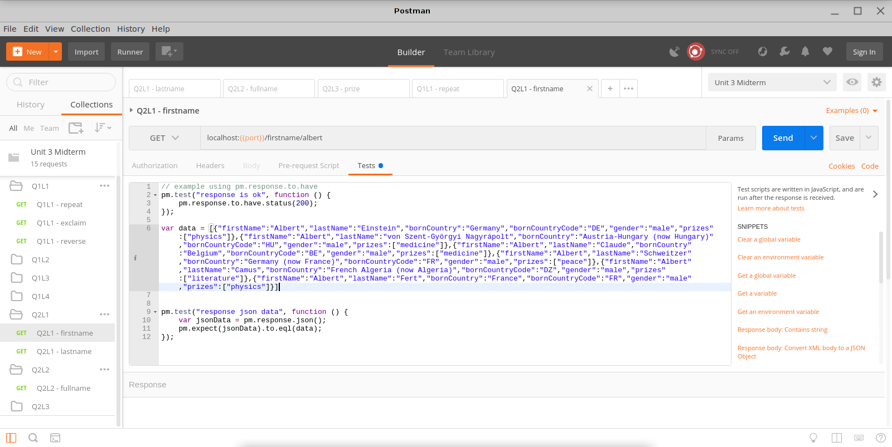

# Using the Postman Request Collection

## Setting Up

1. Download the `Unit 3 Midterm.postman_collection.json` file.
2. In postman, click on `import` and choose the downloaded file.
3. Create a new environment: Click on `new`, choose `environment`, enter an environment name and click add. Enter a key `port` without a value.

close the `manage environents` window.

4. For each student: click on the gear icon in the top right. Click on the environment you've created in step 3. Edit the value for port to the port number used by the student.

## Using the collection

* Once imported, you will be able to see the collection at the left side of the screen.
* The collection has a subfolder per question: `Q1L1/`, `Q1L2`, etc.
* Each request depends on the environment `port` variable. For example: `localhost:{{port}}/reverse/hello`. The port is not hardcoded because not all students use the same port number.
* Each request features two tests that will be executed automatically on the response. The tests themselves can be seen by clicking on the `Tests` tab below the request url.

* The test results can be seen by clicking on the `Test Results` tab to the right of the `Body` tab.

